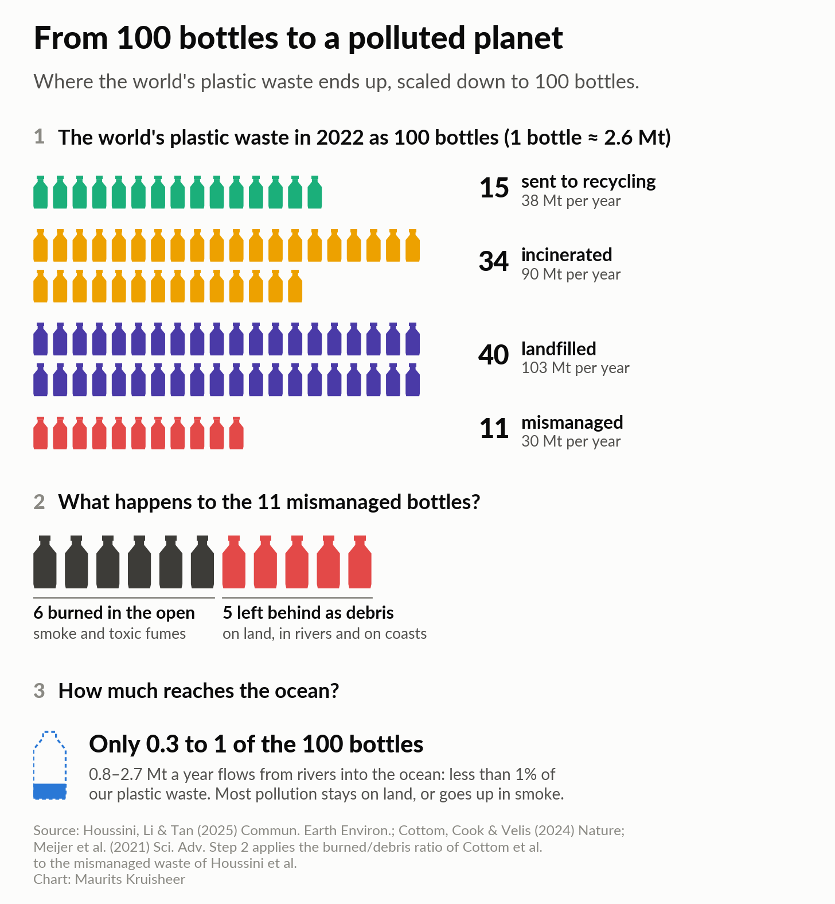
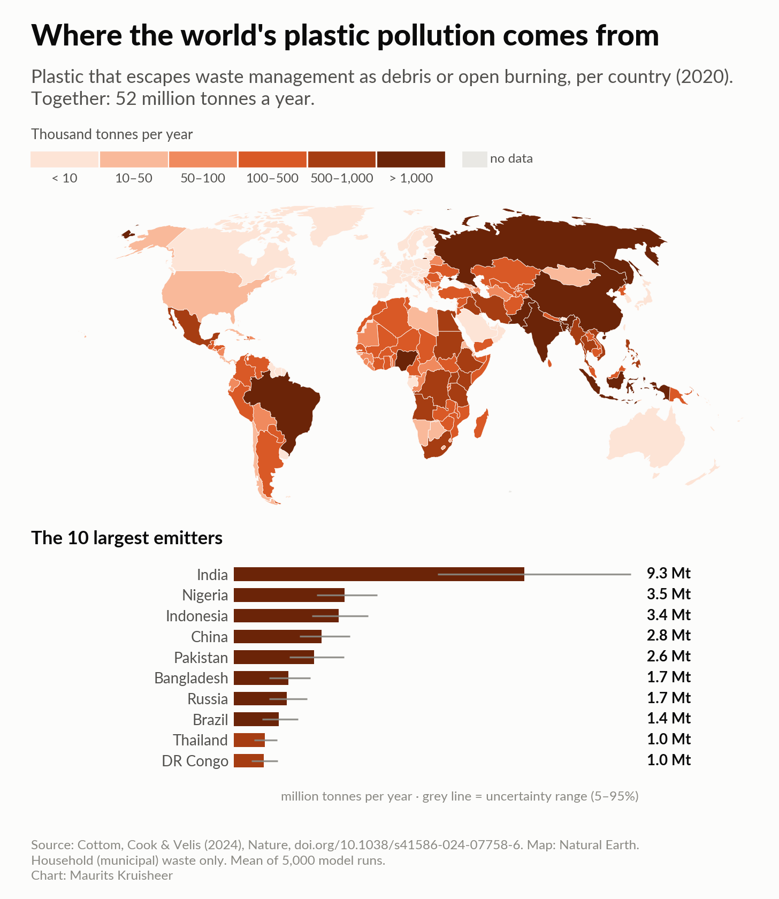
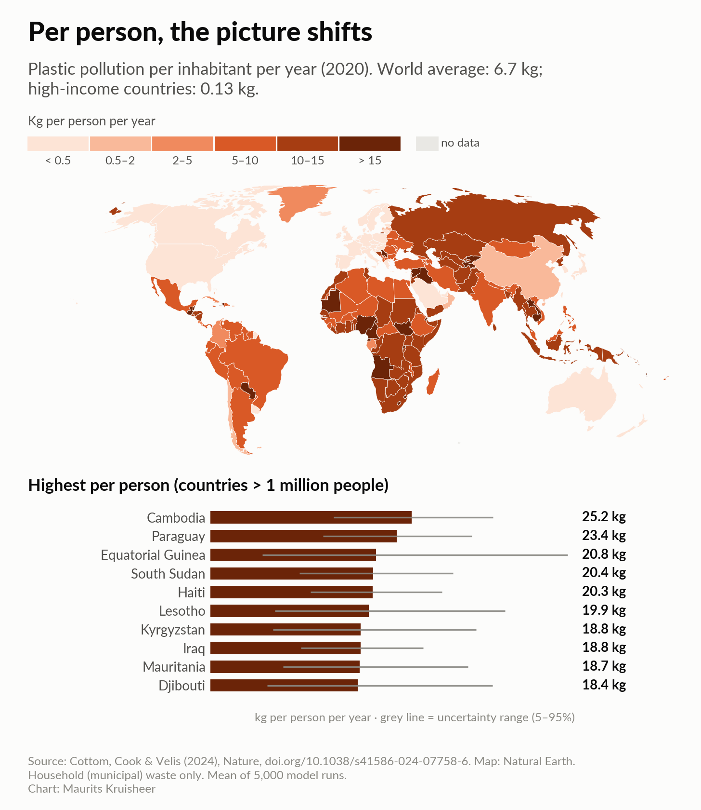
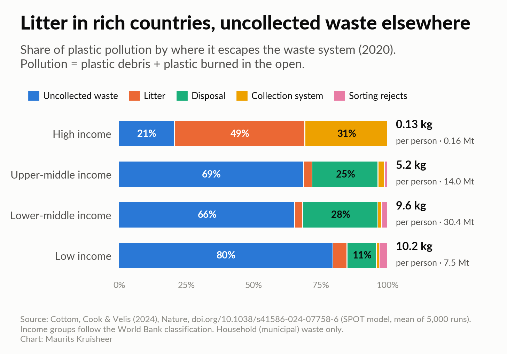

# Where does our plastic end up?

Data, code and figures for the Substack article **"Where Does Our Plastic End Up?"** by Maurits Kruisheer.

> *I dig into environmental problems using science, making theory practical, reproducible and fun. Environmental Scientist on a mission.*

Every figure in the article can be rebuilt from the notebooks here, and you can change them to ask your own questions. No installation needed: click a **Colab** button below and run the notebook in your browser.

## The figures

| Figure | What it shows | Notebook | Open in your browser |
|---|---|---|---|
| **2** | From 100 bottles to a polluted planet: where the world's plastic waste ends up | [`01_where_plastic_ends_up`](notebooks/01_where_plastic_ends_up.ipynb) | [](https://colab.research.google.com/github/MauKruisheer/substack/blob/main/weeks/20260930-where-does-plastic-end-up/notebooks/01_where_plastic_ends_up.ipynb) |
| **3a** | Map: total plastic pollution per country + top 10 | [`02_pollution_maps`](notebooks/02_pollution_maps.ipynb) | [](https://colab.research.google.com/github/MauKruisheer/substack/blob/main/weeks/20260930-where-does-plastic-end-up/notebooks/02_pollution_maps.ipynb) |
| **3b** | Map: plastic pollution per person + top 10 | [`02_pollution_maps`](notebooks/02_pollution_maps.ipynb) | (same notebook) |
| **4** | Uncollected waste vs. litter: sources of pollution by income group | [`03_pollution_sources_by_income`](notebooks/03_pollution_sources_by_income.ipynb) | [](https://colab.research.google.com/github/MauKruisheer/substack/blob/main/weeks/20260930-where-does-plastic-end-up/notebooks/03_pollution_sources_by_income.ipynb) |

Notebook [`00_prepare_data`](notebooks/00_prepare_data.ipynb) shows how the raw research data became the tidy tables the other notebooks use. Start there if you want to understand the data itself.

<p float="left">
  
  
  
  
</p>

## Key numbers

| | Value | Source |
|---|---|---|
| Plastic produced (2022) | ~400 Mt | Houssini et al. 2025 |
| Plastic waste with a known fate (2022) | 261 Mt: 15% sent to recycling, 34% incinerated, 40% landfilled, 11% mismanaged | Houssini et al. 2025 |
| Plastic pollution from household waste (2020) | 52.1 Mt (5–95%: 48.3–56.3 Mt), of which 57% burned in the open | Cottom et al. 2024 |
| Per person, world average | 6.7 kg/year (high-income countries: 0.13 kg) | Cottom et al. 2024 |
| Plastic reaching the ocean via rivers | 0.8–2.7 Mt/year (< 1% of plastic waste) | Meijer et al. 2021 |

*Mt = million tonnes.* "Plastic pollution" here means plastic that escapes the waste system into the open environment, either as **debris** (solid pieces on land and in water) or through **open burning** (backyard fires and burning dumpsites).

## Run it yourself

**In your browser (easiest):** click an *Open in Colab* button above, then *Runtime → Run all*. You need a Google account.

**Or with Binder** (no account): [](https://mybinder.org/v2/gh/MauKruisheer/substack/HEAD?labpath=weeks/20260930-where-does-plastic-end-up/notebooks)

**On your own computer:**

```bash
git clone https://github.com/MauKruisheer/substack
cd substack
pip install -r requirements.txt
jupyter lab weeks/20260930-where-does-plastic-end-up
```

## What's in this repository

```
README.md       this file
data/
  raw/          two spreadsheets from Cottom et al. (2024), copied from the Dryad dataset
  processed/    tidy CSV tables made by notebook 00 (+ the literature numbers for figure 1)
  geo/          world country borders (Natural Earth, 1:110m)
notebooks/      one notebook per figure; each ends with "Try it yourself" ideas
figures/        the figures as PNG (for the article) and SVG (editable)
datawrapper/    ready-to-upload CSVs for interactive versions of figures 3 and 4
src/            shared chart style and the bottle icon
assets/fonts/   Lato font (SIL Open Font License)
```

## Sources

* **Cottom, J.W., Cook, E. & Velis, C.A. (2024).** A local-to-global emissions inventory of macroplastic pollution. *Nature* 633, 101–108. https://doi.org/10.1038/s41586-024-07758-6. Data: https://doi.org/10.5061/dryad.8cz8w9gxb (CC0)
* **Houssini, K., Li, J. & Tan, Q. (2025).** Complexities of the global plastics supply chain revealed in a trade-linked material flow analysis. *Communications Earth & Environment* 6, 257. https://doi.org/10.1038/s43247-025-02169-5
* **Meijer, L.J.J. et al. (2021).** More than 1000 rivers account for 80% of global riverine plastic emissions into the ocean. *Science Advances* 7, eaaz5803. https://doi.org/10.1126/sciadv.aaz5803
* **Natural Earth** country borders, public domain. https://www.naturalearthdata.com

## Caveats (read these before quoting a number)

* **Cottom et al. cover household (municipal) solid waste only**, not industrial, agricultural or construction plastic, and only *macro*plastics (pieces > 5 mm). The real total is larger.
* **The model is probabilistic.** Every number comes from 5,000 simulations. We show the mean, and the 5th–95th percentile range where it matters. Small countries and territories have wide ranges.
* **Figure 1 combines three studies** with different years and definitions. The step from "mismanaged" to "burned vs. debris" borrows only a *ratio* from Cottom et al. Notebook 01 explains this.
* **Year of data:** Cottom et al. model 2020; Houssini et al. 2022.

## Licence

Code: MIT (see `LICENSE` in the repository root). Figures: CC BY 4.0, so feel free to reuse them with credit. Data in `data/raw` and `data/processed` derive from the CC0 Dryad dataset of Cottom et al. (2024). Please cite the original papers.
